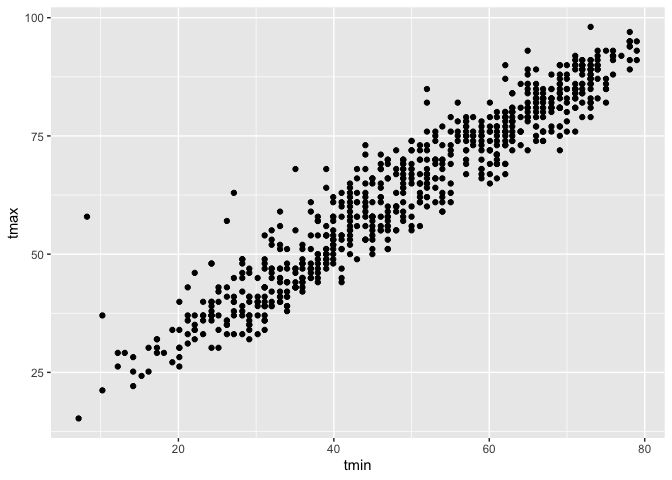

04_dataVis
================
2026-09-29

Import necessary Libraries

``` r
library(tidyverse)
```

    ## ── Attaching core tidyverse packages ──────────────────────── tidyverse 2.0.0 ──
    ## ✔ dplyr     1.2.1     ✔ readr     2.2.0
    ## ✔ forcats   1.0.1     ✔ stringr   1.6.0
    ## ✔ ggplot2   4.0.3     ✔ tibble    3.3.1
    ## ✔ lubridate 1.9.5     ✔ tidyr     1.3.2
    ## ✔ purrr     1.2.2     
    ## ── Conflicts ────────────────────────────────────────── tidyverse_conflicts() ──
    ## ✖ dplyr::filter() masks stats::filter()
    ## ✖ dplyr::lag()    masks stats::lag()
    ## ℹ Use the conflicted package (<http://conflicted.r-lib.org/>) to force all conflicts to become errors

``` r
library(ggridges)
library(p8105.datasets)
data("weather_df")
```

Making a simple scatter plot:

``` r
ggplot(weather_df, aes(x = tmin, y = tmax)) + geom_point()
```

    ## Warning: Removed 17 rows containing missing values or values outside the scale range
    ## (`geom_point()`).

<!-- -->

We can also use the ggplot function after creation of the dataframem and
we can save the plots as well.

``` r
ggp_temp_scatterplot =
  weather_df |> 
    ggplot(aes(x=tmin, y=tmax)) +
    geom_point()

ggp_temp_scatterplot
```

    ## Warning: Removed 17 rows containing missing values or values outside the scale range
    ## (`geom_point()`).

<!-- -->

We can make this a little nicer:

``` r
weather_df |> 
  ggplot(aes(x=tmin, y=tmax)) +
  geom_point(aes(color=name), alpha=0.25) + #opacity
  geom_smooth(se = FALSE) #Smooth lines, Show Standard Error False
```

    ## `geom_smooth()` using method = 'gam' and formula = 'y ~ s(x, bs = "cs")'

    ## Warning: Removed 17 rows containing non-finite outside the scale range
    ## (`stat_smooth()`).

    ## Warning: Removed 17 rows containing missing values or values outside the scale range
    ## (`geom_point()`).

<!-- -->

``` r
#If we move color to point, then the geom_smooth will go through all datapoints instead of separating.
#You can remove the point if you just want a curve
```

Moving to faceting

``` r
weather_df |> 
  ggplot(aes(x=tmin, y=tmax, color=name)) +
  geom_point(alpha=0.5) + 
  #facet_grid(. ~ name) #this is saying where we want the variables go
  #facet_grid(name ~ .)
#The second term (name) decides how we want to column separate and the first term row separates.
  facet_grid(cols=vars(name))
```

    ## Warning: Removed 17 rows containing missing values or values outside the scale range
    ## (`geom_point()`).

<!-- -->

Let’s look at other data:

``` r
weather_df |> 
  ggplot(aes(x = date, y = tmax, color = name)) + 
  geom_point(aes(size = prcp), alpha = .5) +
  geom_smooth(se = FALSE) + 
  facet_grid(. ~ name)
```

    ## `geom_smooth()` using method = 'loess' and formula = 'y ~ x'

    ## Warning: Removed 17 rows containing non-finite outside the scale range
    ## (`stat_smooth()`).

    ## Warning: Removed 19 rows containing missing values or values outside the scale range
    ## (`geom_point()`).

<!-- -->

Make a plot of central park tmax v tmin only, and convert temperatures
to fahrenheit

``` r
weather_df |> 
  filter(name == "CentralPark_NY") |> 
  mutate(
    tmax = tmax* 9/5 + 32,
    tmin = tmin* 9/5 + 32 ) |> 
  ggplot(aes(x=tmin, y=tmax)) + 
  geom_point()
```

<!-- -->
